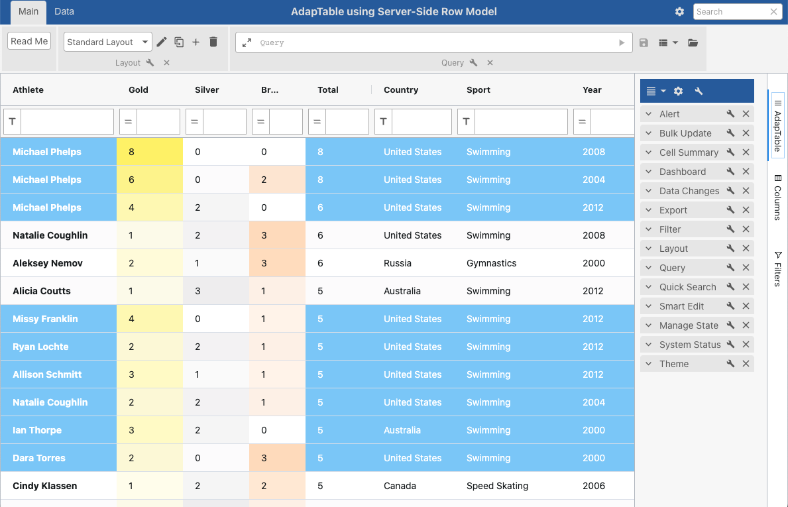

# AdapTable Server-Side Row Model Demo
This small demo application illustrates how to use AG Grid's [Server-Side RowModel](https://www.ag-grid.com/javascript-data-grid/server-side-model/) inside [AdapTable](https://www.adaptabletools.com/).

The demo is based on AG Grid's own [nodejs example](https://www.ag-grid.com/react-data-grid/server-side-operations-nodejs/) and uses the same data source.

It is a copy of the demo example provided in [Adaptable Docs](https://docs.adaptabletools.com/guide/dev-guide-row-models-server-overview)

In particular the demo shows how - with very little custom code - you are still able to leverage key features in AdapTable while using the Server-Side Row Model, including:

- [Evaluating Predicates](https://docs.adaptabletools.com/guide/adaptable-predicate) (primarily used in [Column Filters](https://docs.adaptabletools.com/guide/handbook-column-filter))
- [Evaluating Expressions](https://docs.adaptabletools.com/guide/adaptable-ql-expression) (used extensively in AdapTable e.g. for Queries, Alerts and Calculated Columns)
- [Getting Distinct Column Values](https://docs.adaptabletools.com/guide/dev-guide-tutorial-column-values)
- [Pivot Layouts](https://docs.adaptabletools.com/guide/handbook-layouts-pivot)
- [Custom Sorts](https://docs.adaptabletools.com/guide/handbook-sorting-custom)
- [Export](https://docs.adaptabletools.com/guide/handbook-exporting)

**Note: The code is provided as a Starter Guide for demonstration purposes only: it's NOT production ready and shouldn't be used as is**

Additionally, the example includes a small subset of the huge number of other features in AdapTable - which are available in Server-Side Row Model with **no** custom code required:

- [Gradient Styles](https://docs.adaptabletools.com/guide/handbook-styled-column-gradient)
- [Layouts](https://docs.adaptabletools.com/guide/handbook-layouts)
- [Custom Toolbars](https://docs.adaptabletools.com/guide/ui-dashboard-custom-toolbars)

## Usage

- Clone the project
- run `npm install` in root, client and server folders
- start with `npm start`

## Licences

A licence for AdapTable provides access to all product features as well as quarterly updates and enhancements through the lifetime of the licence, comprehensive support, and access to all 3rd party libraries.

We can make a trial licence available for a short period of time to allow you to try out AdapTable for yourself.

Please contact [`sales@adaptabletools.com`](mailto:sales@adaptabletools.com) or read the [Licence Documentation](https://docs.adaptabletools.com/guide/licensing) for more information.

## Demo

To see AdapTable React in action visit [Adaptable Documentation](https://docs.adaptabletools.com/) which contains a large number of small demos each showing a different feature, function or option in AdapTable React (using dummy data sets).

Additionally, there is a page with larger 'recipe-type' Demos at the [Adaptable Tools website](https://www.adaptabletools.com/demos).

## Help

Developers can learn how to access AdapTable React programmatically at [AdapTable Documentation](https://docs.adaptabletools.com).

General information about Adaptable Tools is available at our [Website](http://www.adaptabletools.com)

## Support

For all support enquiries please email [`support@adaptabletools.com`](mailto:support@adaptabletools.com) or [raise a Support Ticket](https://adaptabletools.zendesk.com/hc/en-us/requests/new).
